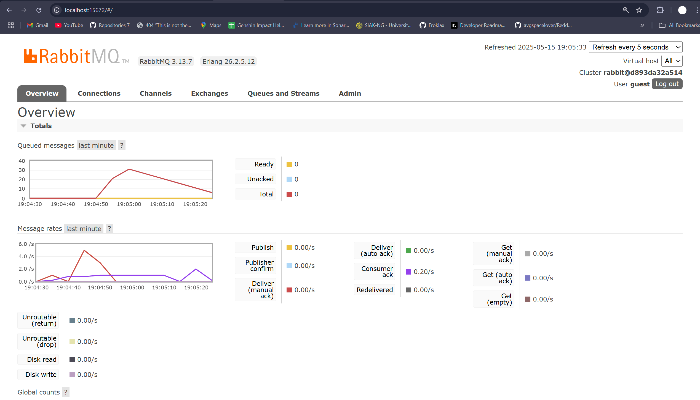
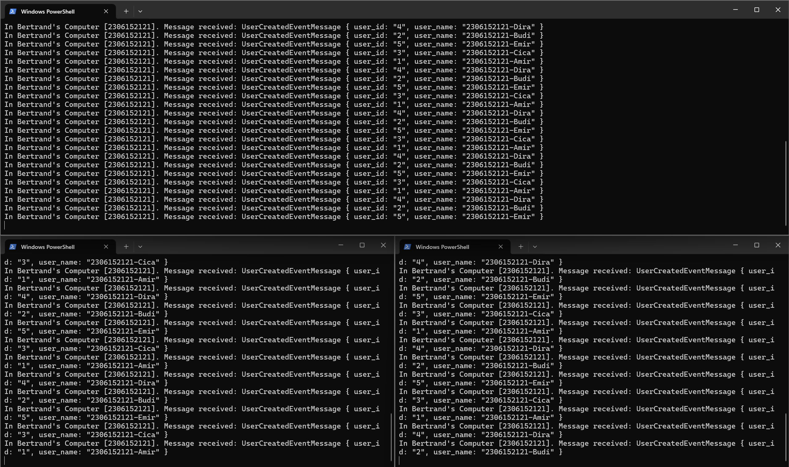
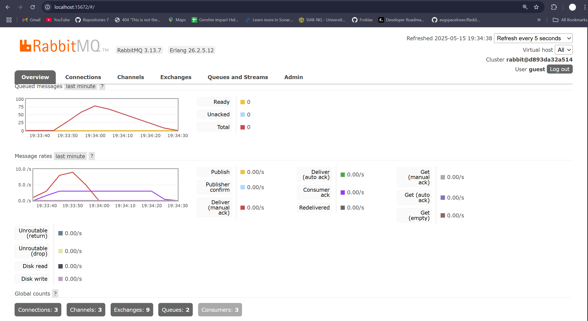

# Subscriber Reflection

### a. What is amqp?

amqp adalah singkatan dari Advanced Message Queuing Protocol. Ini adalah sebuah _open standard protocol_ pada _application layer_ yang dirancang untuk _message-oriented middleware_. amqp menyediakan aturan dan format agar berbagai aplikasi atau software service dapat saling bertukar messages secara aman dan terpercaya, bahkan jika aplikasi tersebut dibuat dalam bahasa pemrograman yang berbeda atau berjalan pada sistem operasi yang berbeda. Message yang dimaksud di sini adalah unit data yang dikirim dari satu entity (publisher) ke entity lain (subscriber), biasanya melalui message broker. amqp mendefinisikan bagaimana messages disusun dan bagaimana connection dibuat dan dikelola, membuat message yang diterima bisa dikimkan dari satu point ke point yang lain atau bisa seperti model publisher-subscriber.

### b. What does it mean? guest:guest@localhost:5672 , what is the first guest, and what is the second guest, and what is localhost:5672 is for?

Pada "guest:guest@localhost:5672", setiap komponen memiliki peran dalam membangun koneksi ke server amqp. Bagian "first guest" adalah representasi dari username yang digunakan untuk proses autentikasi ketika aplikasi mencoba terhubung ke server amqp. Bagian "second guest" adalah password yang berkaitan dengan username "guest" tersebut. Kombinasi username dan password ini digunakan oleh server untuk memverifikasi identitas client. "localhost:5672" adalah alamat host atau nama server tempat layanan amqp yang merupakan broker sedang berjalan. Dalam konteks ini, "localhost" berarti server amqp tersebut beroperasi local machine yang sama dengan aplikasi subscriber. "5672" adalah nomor port yang digunakan oleh protocol amqp untuk mendengarkan koneksi masuk yang tidak encrypted. Kesimpulannya, "guest:guest@localhost:5672" menginstruksikan aplikasi subscriber untuk membuat koneksi ke layanan amqp yang berjalan pada local machine melalui port 5672, dengan menggunakan "guest" sebagai username dan "guest" sebagai password untuk autentikasi.

## Images

### Grafik pertama menunjukkan spike yang terjadi saat mensimulasikan subscriber yang lambat dalam memproses data. Tampak bahwa terdapat sekitar 30 lebih message yang berada dalam queue dalam beberapa detik sebelum jumlahnya berkurang. Hal ini terjadi karena subscriber membutuhkan waktu 10ms untuk memproses setiap message, sehingga ketika publisher mengirim banyak event dalam waktu singkat, message sementara menumpuk di RabbitMQ sebelum akhirnya diproses.

### Gambar 3 program subscriber menerima message dari publisher yang dijalankan berkali-kali.

### Gambar menunjukkan chart RabbitMQ di mana spike pada queued messages berkurang lebih cepat dibandingkan sebelumnya. Hal ini terjadi karena adanya multiple subscriber yang berjalan secara paralel, sehingga pesan dalam queue tidak hanya menunggu satu subscriber untuk diproses, melainkan didistribusikan ke beberapa subscriber yang tersedia. Ketika satu subscriber masih memproses data, RabbitMQ dapat segera mengirimkan pesan berikutnya ke subscriber lain yang sudah siap, mengurangi waktu tunggu pesan dalam queue. Pola ini terlihat pada perbedaan distribusi pesan di setiap subscriber, yang memproses pesan dalam urutan yang berbeda-beda, membantu mempercepat keseluruhan proses pengambilan dan pemrosesan event. Terdapat juga bagian kode yang bisa ditingkatkan, yaitu optimasi pemrosesan pesan di subscriber. Saat ini, subscriber memiliki delay tetap selama 1 detik menggunakan `thread::sleep(Duration::from_millis(1000));` yang menyebabkan pemrosesan pesan menjadi lebih lambat dan menumpuk di queue jika banyak event dikirim dalam waktu singkat. Jika delay ini dikurangi atau dioptimalkan menggunakan async processing, maka sistem dapat menangani lebih banyak pesan dalam waktu lebih singkat dan mengurangi jumlah pesan yang tertahan di queue.
